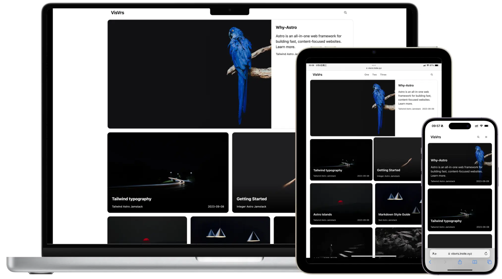

## 🌍Language Versions / 语言版本

🇺🇸[English](README.md) 🇨🇳[中文](README_CN.md)

## 🚀 **AstroVerse**: An Astro Theme for Visual Storytelling

AstroVerse is an Astro theme tailored for captivating photo-text storytelling.

It seamlessly merges visuals and written content, empowering creators to deliver compelling narratives with high-impact imagery.

Ideal for bloggers and content creators seeking to make their stories stand out through the fusion of striking visuals and engaging prose, AstroVerse provides a platform to create immersive and influential digital experiences.



## 💯Lighthouse Score

<p align="center">
  <a href="https://pagespeed.web.dev/analysis?url=https%3A%2F%2Fverse-astro.vercel.app%2F">
    
  <a>
</p>

## 🎉 Features

- ✅ Powered by Astro
- ✅ Development with Tailwind CSS and Preline UI
- ✅ Fully Responsive Design
- ✅ Perfect 100/100 Lighthouse Performance Score
- ✅ SEO Optimized
- ✅ Inbuilt Site Search
- ✅ Sitemap and RSS Feed Support
- ✅ Markdown & MDX Ready
- ✅ Tag Statistics and Last Modified Time Display
- ✅ Optimized Image Handling
- ✅ Automatic Dark Mode Switching
- ✅ Pagination for Easy Navigation
- ✅ Code formatted with Prettier in one click

## 🎡 Live demo

Experience [**AstroVerse**](https://verse-astro.vercel.app) in action.

## 🌆 Showcase

Share your project built with AstroVerse! Open an issue titled "Showcase Submission" with your project's details to be featured in our Showcase.


## 💻 Running Locally

**Recommended extensions for VSCode:**

- [Tailwind CSS IntelliSense](https://marketplace.visualstudio.com/items?itemName=bradlc.vscode-tailwindcss).
- [Astro](https://marketplace.visualstudio.com/items?itemName=astro-build.astro-vscode).

1. Fork or use this [template](https://github.com/isooosi/astroverse)

2. Install dependencies:

```bash
pnpm install
```

3. Run the development server:

```bash
pnpm run dev
```

## 📄 Adding a post

Adding a post is as simple as adding a .md or .mdx file to the blog folder at the path **src/content/posts**.

## 🧞 Commands

All commands are run from the root of the project, from a terminal:

| Command           | Action                                       |
| :---------------- | :------------------------------------------- |
| `pnpm install`     | Installs dependencies                        |
| `pnpm run dev`     | Starts local dev server at `localhost:4321`  |
| `pnpm run build`   | Build your production site to `./dist/`      |
| `pnpm run preview` | Preview your build locally, before deploying |
| `pnpm run format`  | Code formatter using prettier                |
| `npx @astrojs/upgrade`  | To upgrade                |

### 🔧Configuration

Basic configuration file: `./src/consts.ts`

```ts
// Place any global data in this file.
// You can import this data from anywhere in your site by using the `import` keyword.

// Base Page Metadata, src/layouts/BaseLayout.astro
export const BRAND_NAME = "AstroVerse";
export const SITE_TITLE = "AstroVerse";
export const SITE_DESCRIPTION = "An Astro Theme for Visual Storytelling";

// Tags Page Metadata, src/pages/tags/index.astro
export const Tags_TITLE = "AstroVerse - All Tags";
export const Tags_DESCRIPTION =
  "AstroVerse - All tags and the count of articles related to each tag";

// Tags Page Metadata, src/pages/tags/[tag]/[page].astro
export function getTagMetadata(tag: string) {
  return {
    title: `All articles on '${tag}' tag in AstroVerse`,
    description: `Explore articles about ${tag} for different perspectives and in-depth analysis.`,
  };
}

// Category Page Metadata, src/pages/category/[category]/[page].astro
export function getCategoryMetadata(category: string) {
  return {
    title: `All articles in '${category}' category in AstroVerse`,
    description: `Browse all articles under the ${category} category in AstroVerse`,
  };
}

// Header Links, src/components/Header.astro
export const HeaderLinks = [
  { href: "/category/One/1/", title: "One" },
  { href: "/category/Two/1/", title: "Two" },
  { href: "/category/Three/1/", title: "Three" },
];

// Footer Links, src/components/Footer.astro
export const FooterLinks = [
  { href: "/posts/why-astro/", title: "Astro" },
  { href: "/posts/tailwind-typography/", title: "Tailwind" },
  { href: "/tags/", title: "Tags" },
];

// Social Links, src/components/Footer.astro
export const SocialLinks = [
  { href: "/rss.xml", icon: "tabler:rss", label: "RSS" },
  {
    href: "https://twitter.com/astrodotbuild",
    icon: "tabler:brand-twitter",
    label: "Twitter",
  },
  {
    href: "https://github.com/isooosi",
    icon: "tabler:brand-github",
    label: "GitHub",
  },
];

// Search Page Metadata, src/pages/search.astro
export const SEARCH_PAGE_TITLE = `${SITE_TITLE} - Site Search`;
export const SEARCH_PAGE_DESCRIPTION = `Search all content on ${SITE_TITLE}`;
```


## Deployment

Click the button below to start deploying your project on Vercel:

[](https://vercel.com/import/project?template=https://github.com/isooosi/astroverse)

## ✨ Join and Contribute

Your contributions make AstroVerse better! Whether it's through code, design, bug reports, or feature ideas, we value your input. Check our Issues or submit a Pull Request to get started. Together, let's enhance AstroVerse!
